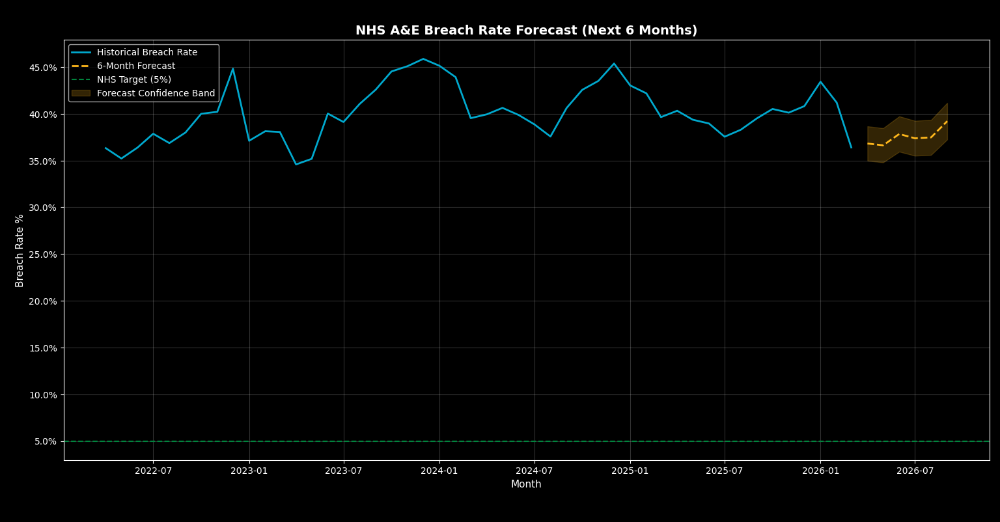

# 🏥 NHS A&E Performance Analysis Dashboard

SQL | Python | Power BI | 4 Years of NHS England Data

An end-to-end data analytics project analysing 4 years of NHS England A&E performance data (April 2022 – March 2026) to identify key drivers of 4-hour target breaches and highlight operational inefficiencies across hospital trusts.

## 📊 Project Overview

This dashboard analyses A&E attendance and 4-hour breach rate data across 232 NHS trusts in England, identifying underperforming trusts, seasonal demand patterns, and year-on-year performance trends.

## 📏 Key Metrics

- **Breach Rate (%)** = Patients waiting over 4 hours ÷ Total A&E attendances  
- **YoY Change (%)** = Year-on-year percentage change in breach rate  

**Business Question:**
> Which NHS trusts are underperforming against A&E wait time targets, and what operational patterns (seasonality, regional variation, demand pressure) explain these breaches?

---

## 🔍 Key Findings

- **40.07% national breach rate** — ~4 in 10 patients waited over 4 hours  
- **United Lincolnshire Hospitals NHS Trust** — worst performing trust (~59% breach rate)  
- **Clear seasonal pattern** — breach rates peak in December (~43.9%) and are lowest in May (~37.6%)  
- **Significant variation across trusts** — most operate between 52%–58% breach rate  
- **National improvement in 2025** — breach rate decreased by ~1.6 percentage points vs 2024  
- **NHS North West** — highest regional pressure (~44% breach rate)  

---

## 🐍 Python Analysis

Python was used for data cleaning, transformation, and time-series analysis to support and validate insights from the dashboard.

### Key Analysis Performed

- Calculated A&E breach rate from raw attendance data  
- Analysed monthly trends and rolling averages  
- Identified strong seasonal patterns in A&E performance  
- Built a simple forecasting model to estimate future breach rates  

### Insights from Python Analysis

- Breach rates show a clear seasonal pattern, peaking during winter months (Dec–Jan)  
- Trend analysis indicates a gradual increase followed by slight improvement in 2025  
- Forecast suggests breach rates are likely to stabilise around ~40%, with seasonal spikes expected  


## 🔮 Forecasting Approach

A time-series forecasting model (Exponential Smoothing) was applied to estimate future A&E breach rates based on historical trends.

This model captures underlying patterns in the data and provides a forward-looking view of A&E performance, particularly useful for anticipating seasonal pressure.

Python-based analysis was used to validate trends and seasonal patterns observed in the Power BI dashboard, ensuring consistency and analytical accuracy.

These analyses complement the dashboard by providing deeper validation and forward-looking insights into A&E performance trends.

## 📈 Business Impact

This project demonstrates an end-to-end analytics workflow from raw data processing to insight generation and stakeholder-ready visualisation.

## 🏥 Real-World Application

This dashboard can be used by NHS managers and healthcare analysts to:
- Monitor A&E performance in real time  
- Identify underperforming trusts  
- Allocate staffing and resources more effectively  
- Plan for seasonal demand surges  

## 🛠️ Tools Used

| Tool | Purpose |
|---|---|
| Python (pandas, statsmodels) | Data cleaning, transformation, time-series analysis, and forecasting |
| MySQL | Data storage, aggregation, and KPI calculations across NHS trusts |
| Power BI | Interactive dashboard development and visualisation of trends, regional performance, and trust-level insights |

## 📁 Repository Structure

```
nhs-ae-dashboard/
│
├── sql/
│   ├── 01_create_table.sql
│   ├── 02_breach_rate_by_trust.sql
│   ├── 03_national_trend.sql
│   ├── 04_seasonal_analysis.sql
│   ├── 05_yoy_deterioration.sql
│   └── 06_critical_12hr_waits.sql
|
├── notebooks/
│   └── analysis.py
│
├── screenshots/
│   ├── page1_national_overview.png
│   ├── page2_trust_comparison.png
│   └── page3_seasonal_patterns.png
│
├── NHS_AE_Performance_Dashboard.pbix
└── README.md
```
## 📸 Dashboard Preview

### Page 1 — National Overview


### Page 2 — Trust Comparison


### Page 3 — Seasonal Patterns


### 🐍 Python Analysis (Supporting Insights)

#### Forecasted A&E Breach Rate


#### Seasonal Pattern Analysis


---

## 💡 Recommendations

1. **Increase winter staffing capacity** — breach rates in Dec–Jan are ~6% higher than summer months  
2. **Target high-performing outliers** — United Lincolnshire and Shrewsbury consistently exceed 55% breach rates  
3. **Address regional imbalance** — NHS North West shows highest sustained pressure  
4. **Sustain improvement strategies** — replicate 2025 interventions that reduced national breach rate by ~1.6%  

---

## ⚠️ Limitations

- Analysis is based on aggregated monthly data (no patient-level granularity)  
- External factors such as staffing levels and local policies are not included  
- Forecasting is based on historical trends and does not account for unexpected system changes  

## 📂 Data Source

Official NHS England A&E Attendances and Emergency Admissions statistics:
🔗 https://www.england.nhs.uk/statistics/statistical-work-areas/ae-waiting-times-and-activity/

---

## 👤 Author

**Zaid Rupani**  
MSc Data Science & Analytics — University of Leeds  
📧 zaidrupani.work@gmail.com  
🔗 LinkedIn: [(add your link here)](https://www.linkedin.com/in/zaid-rupani-b027b420b/)
🔗 Portfolio: https://www.datascienceportfol.io/zaidrupani
