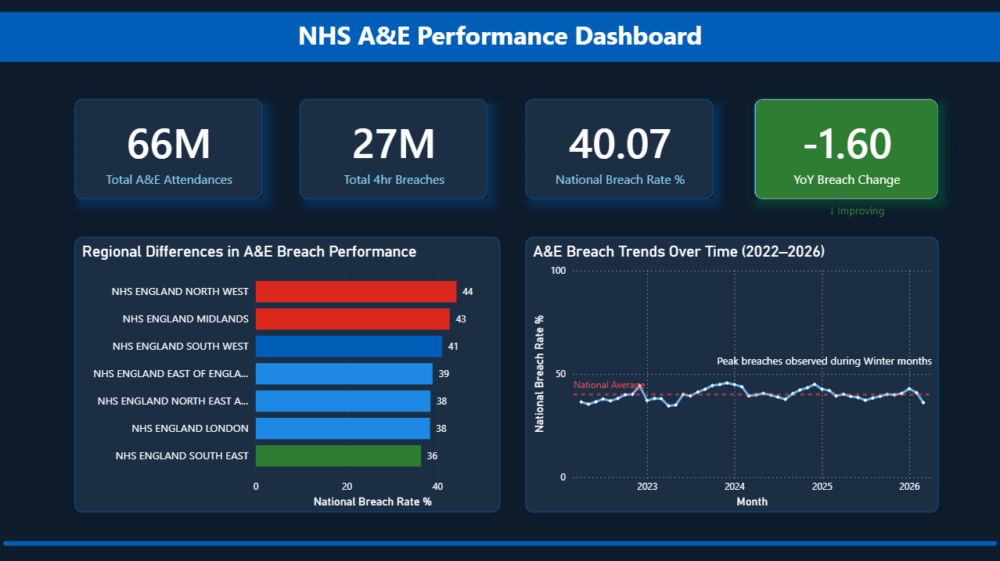
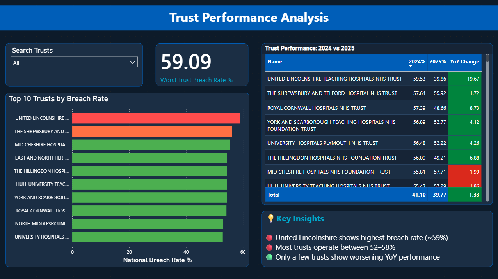
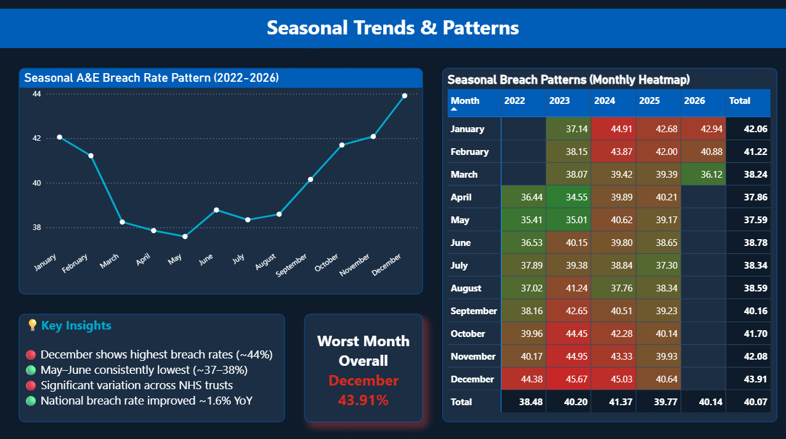

# nhs-ae-dashboard
NHS A&amp;E Performance Dashboard — SQL, Power BI | 4 years of official NHS England data

# 🏥 NHS A&E Performance Dashboard

A data analytics project analysing 4 years of official NHS England A&E performance data (April 2022 – March 2026) using SQL and Power BI.

## 📊 Project Overview

This dashboard analyses A&E attendance and 4-hour breach rate data across 232 NHS trusts in England, identifying underperforming trusts, seasonal demand patterns, and year-on-year performance trends.

**Business Question:**
> Which NHS trusts are struggling with A&E wait times, and what patterns explain it?

---

## 🔍 Key Findings

- **40.07% national breach rate** — 4 in every 10 patients waited over 4 hours
- **United Lincolnshire Hospitals NHS Trust** — worst performing trust at 59.09%
- **December consistently the worst month** — average breach rate of 43.91%
- **May consistently the best month** — average breach rate of 37.59%
- **National improvement in 2025** — breach rate dropped 1.6 percentage points vs 2024
- **NHS North West** — highest regional breach rate at 44%

---

## 🛠️ Tools Used

| Tool | Purpose |
|---|---|
| Python (pandas) | Data collection, cleaning, combining 48 CSV files |
| MySQL | Database setup, data loading, analytical queries |
| Power BI | Interactive dashboard and visualisation |

## 📁 Repository Structure

```
nhs-ae-dashboard/
│
├── sql/
│   ├── 01_create_table.sql
│   ├── 02_breach_rate_by_trust.sql
│   ├── 03_national_trend.sql
│   ├── 04_seasonal_analysis.sql
│   ├── 05_yoy_deterioration.sql
│   └── 06_critical_12hr_waits.sql
│
├── screenshots/
│   ├── page1_national_overview.png
│   ├── page2_trust_comparison.png
│   └── page3_seasonal_patterns.png
│
├── NHS_AE_Performance_Dashboard.pbix
└── README.md
```
## 📸 Dashboard Preview

### Page 1 — National Overview


### Page 2 — Trust Comparison


### Page 3 — Seasonal Patterns


---

## 💡 Recommendations

Based on the analysis:

1. **Increase winter staffing** — December and January breach rates are consistently 6% above summer average
2. **Prioritise intervention** at United Lincolnshire and Shrewsbury — breach rates exceeding 55% across 4 years
3. **Investigate NHS North West** — highest regional breach rate at 44% nationally
4. **Replicate 2025 improvement strategies** — national breach rate dropped 1.6% vs 2024

---

## 📂 Data Source

Official NHS England A&E Attendances and Emergency Admissions statistics:
🔗 https://www.england.nhs.uk/statistics/statistical-work-areas/ae-waiting-times-and-activity/

---

## 👤 Author

**Zaid Rupani**
MSc Data Science & Analytics — University of Leeds
📧 zaidrupani.work@gmail.com
