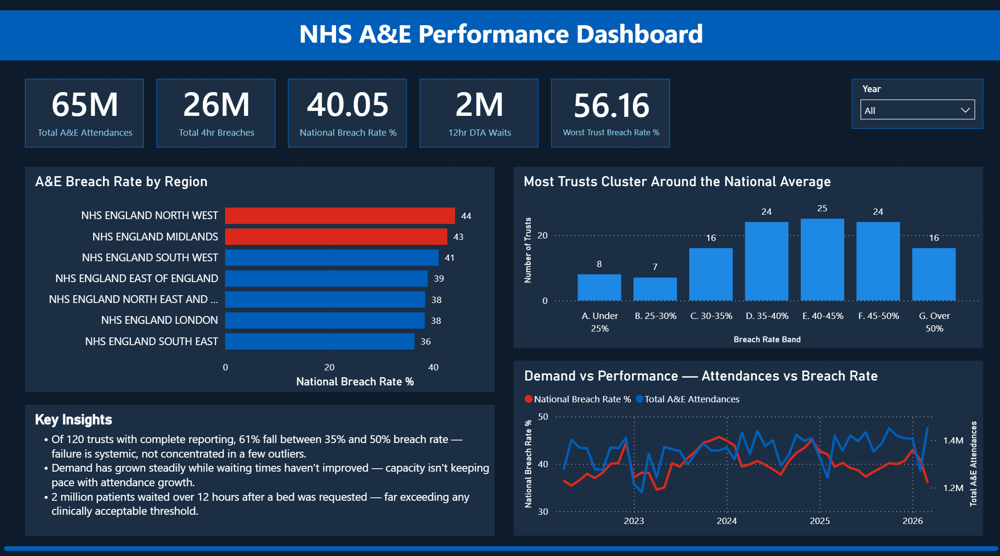

# 🏥 NHS A&E Performance Dashboard

**Python · MySQL · Power BI | 48 months of official NHS England data**

An end-to-end analytics project examining A&E four-hour performance across NHS England, covering April 2022 to March 2026. The project identifies underperforming trusts, quantifies seasonal pressure, and forecasts breach rates twelve months ahead.

---

## 📊 Project Overview

NHS England publishes monthly A&E attendance and performance data for every acute trust. This project consolidates 48 monthly files into a single analytical dataset, applies data quality corrections, and presents the results through a three-page interactive Power BI report.

**Business question**

> Which NHS trusts are underperforming against A&E wait time targets, what operational patterns explain those breaches, and what should we expect next winter?

**The four-hour standard**

The operational standard is that 95% of patients should be admitted, transferred or discharged within four hours of arrival — a maximum acceptable breach rate of 5%. This analysis uses Type 1 (consultant-led, 24-hour) A&E departments only, which is the stricter and more commonly scrutinised measure.

---

## 🔍 Key Findings

- **40.05% national breach rate** across the period — roughly 4 in 10 patients waited over four hours, eight times the operational standard
- **Shrewsbury and Telford Hospital NHS Trust** is the worst sustained performer at **56.16%** across all 48 months
- **Failure is systemic, not isolated** — of 120 trusts with complete reporting history, 61% fall between 35% and 50% breach rate. Only 15 trusts achieve under 30%, and even those are six times the target
- **Strong seasonal pattern** — December averages 43.91% against May's 37.59%, a 6.3 percentage point swing repeated every year
- **Bed capacity, not attendance volume, drives winter pressure** — 12-hour waits following a decision to admit peak in January and February alongside breach rates, while attendance growth has been modest
- **NHS North West** carries the highest regional pressure at ~44%
- **Forecast projects December 2026 at 42.70%** — marginally below the four-year December average, but no material improvement expected

---

## 🧹 Data Quality Work

Three issues in the source data materially affected the results. All three were identified during analysis and corrected in the pipeline.

**Trust renames splitting organisations across rows**

Nine trusts were renamed or merged during the period, appearing under both old and new names with no linking identifier. United Lincolnshire Hospitals NHS Trust, for example, became United Lincolnshire Teaching Hospitals NHS Trust in November 2024 — 31 months under one name, 17 under the other.

Calculated separately, the older rows returned a 59.09% breach rate, which ranked the trust worst in England. Once the two records were combined into the full 48-month history, the true figure was **51.20%** — outside the top ten. A rename mapping now standardises all affected trusts to their current name before aggregation.

**Attendances recorded with zero breaches**

196 trust-months showed non-zero attendances alongside zero recorded four-hour breaches. A trust handling thousands of Type 1 attendances with no breaches at all is not plausible performance; it is missing data. Mid Yorkshire Hospitals accounted for 13 consecutive months of this, which caused it to appear as the single best performing trust in England at 0.00%.

These values are now set to null rather than deleted, preserving the attendance figures for demand analysis while excluding them from breach rate calculations.

**Aggregate rows in source files**

The published files include a `TOTAL` row alongside individual trusts. This is now removed at source rather than filtered per visual, eliminating the risk of a missed filter silently corrupting a chart.

**Reporting threshold for rankings**

Trusts require at least 36 months of data and 100,000 attendances to appear in ranked comparisons. A trust with six months of history is not comparable to one with forty-eight. This threshold applies to rankings only — all trusts contribute to national and regional aggregates, since their attendances and breaches are real regardless of reporting history.

---

## 🔮 Forecasting

A Holt-Winters Exponential Smoothing model (additive trend, additive seasonality, 12-month period) projects national breach rates twelve months beyond the dataset.

| Month | Projected |
|---|---|
| Apr 2026 | 36.54% |
| Jul 2026 | 37.12% |
| Oct 2026 | 40.48% |
| **Dec 2026** | **42.70%** |
| Mar 2027 | 37.02% |

The model extrapolates historical seasonal patterns and assumes current conditions hold. It does not account for funding changes, staffing interventions, or unusual demand events.

---

## 🛠️ Tools

| Tool | Purpose |
|---|---|
| Python (pandas) | Consolidating 48 monthly files, data quality corrections, feature engineering |
| statsmodels | Exponential Smoothing forecast |
| MySQL | Storage, aggregation, analytical queries |
| Power BI | Three-page interactive report, DAX measures |

---

## 📁 Repository Structure

```
nhs-ae-dashboard/
│
├── data/
│   └── (source monthly CSVs from NHS England)
│
├── sql/
│   ├── 01_create_table.sql
│   ├── 02_breach_rate_by_trust.sql
│   ├── 03_national_trend.sql
│   ├── 04_seasonal_analysis.sql
│   ├── 05_yoy_deterioration.sql
│   └── 06_critical_12hr_waits.sql
│
├── notebooks/
│   └── analysis.py
│
├── screenshots/
│   ├── page1_national_overview.png
│   ├── page2_trust_performance.png
│   └── page3_seasonal_operational.png
│
├── data_pipeline.py
├── NHS_AE_Performance_Dashboard.pbix
└── README.md
```

---

## 📸 Dashboard

### Page 1 — National Overview
National KPIs, regional comparison, distribution of trust breach rates, and demand against performance over time.



### Page 2 — Trust Performance
Best and worst performers, largest year-on-year deteriorations, and a drill-down showing any selected trust's full monthly history against the national average.


### Page 3 — Seasonal & Operational Pressure
Seasonal breach patterns alongside bed capacity indicators, emergency admissions trend, and the twelve-month forecast.


---

## 💡 Recommendations

1. **Plan winter capacity against a 6.3 point seasonal swing** — December breach rates are predictably worse every year, and the forecast expects the pattern to repeat in 2026
2. **Treat bed availability as the binding constraint** — 12-hour DTA waits peak alongside breach rates while attendance growth has been modest, pointing to discharge and ward capacity rather than front-door demand
3. **Prioritise sustained underperformers over headline cases** — Shrewsbury and Telford, Mid Cheshire and Hillingdon have all exceeded 54% across the full period
4. **Recognise the problem as systemic** — with 61% of trusts clustered between 35% and 50%, trust-level intervention alone is unlikely to shift national performance

---

## ⚠️ Limitations

- Type 1 departments only; figures are not comparable to all-types A&E reporting, which runs considerably higher
- Monthly aggregates at trust level — no patient-level or departmental granularity
- 2022 begins in April and 2026 ends in March, so neither is a complete calendar year and year-on-year comparisons use 2023–2025
- The forecast assumes historical patterns persist and cannot anticipate policy or funding changes

---

## 📂 Data Source

NHS England — A&E Attendances and Emergency Admissions
🔗 https://www.england.nhs.uk/statistics/statistical-work-areas/ae-waiting-times-and-activity/

---

## 👤 Author

**Zaid Rupani**
MSc Data Science & Analytics — University of Leeds
📧 zaidrupani.work@gmail.com
🔗 [LinkedIn](https://www.linkedin.com/in/zaid-rupani-b027b420b/)
🔗 [Portfolio](https://www.datascienceportfol.io/zaidrupani)
